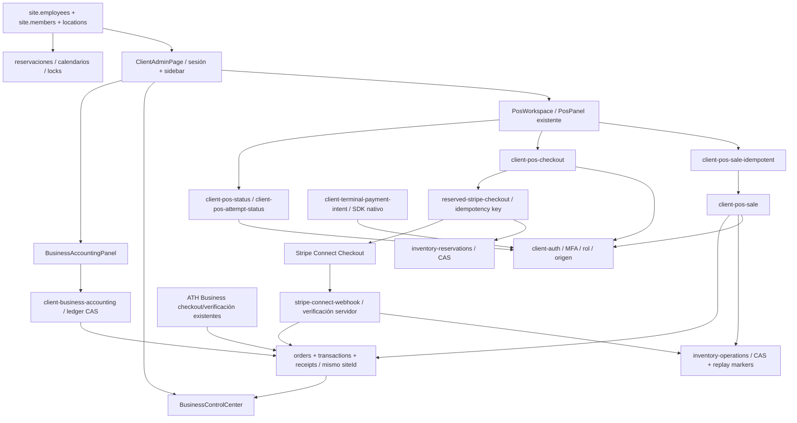

# WebFactory POS 2.0 + Workforce · Etapa 1

Base: `main` actualizado, `86c32a265532dcbada43c840ae29d1ddc8c5ae90`. Rama: `feat/webfactory-pos-v2-workforce`. PR #101 (`feat/client-edit-public-site-url-20261010`, `29ae6a5`) permanece independiente; no se incorpora. Netlify project/site existentes: webfactorypr / 1fa77856-faad-4f0f-8f7c-2671e772513f. No publicación en producción.

## Capacidades verificadas del entorno

- GitHub CLI/API: lectura, creación de rama, push y PR con credencial existente; sin exposición de tokens.
- Node 22, npm, TypeScript, Vite, Playwright Chromium y driver WebKit oficial disponibles en cloud.
- MCP WebFactory/Graphify: ninguna operación `wf_*` invocable en el catálogo de herramientas. El gateway real `netlify/lib/chatgpt-graphify.mjs` se comprobó: `401 Graph context authorization is unavailable` antes de enviar solicitudes. No se inventó contexto remoto ni se creó un MCP.
- Shadcn y Stitch: conectores registrados como recursos de plugins, pero sin herramientas invocables. Se reutiliza `src/components/ui/input.tsx`, `components.json`, Lucide y el diseño existente; no hay resultados de búsqueda remota o generación Stitch que declarar.
- Netlify: configuración del repo, checks GitHub y lectura del preview. No hay token de API Netlify en este cloud.
- Anti-Slop core/UI/human vendorizados, modo After exigido por AGENTS.md. Impeccable 4.1.0 es detector local, no MCP.

Las escrituras de código se realizan con permisos escalados porque el sandbox es de solo lectura. QA intercepta APIs o usa stores en memoria; ninguna venta, fichaje ni actualización de clientes reales.

## Mapa de dependencias confirmado por imports/código

Este mapa es análisis estático local, **no resultado de Graphify**.

POS presencial registra efectivo/ATH manual/otro recibido, con confirmación explícita del cajero. ATH manual no es verificación del proveedor. Stripe Checkout crea un pago pendiente y reserva stock; solo backend/webhook confirma el resultado. Stripe Terminal permanece separado, con restricciones reales de SDK/dispositivo; Safari no tiene NFC de pagos. Los endpoints POS y Terminal comparten validación nueva de permisos para descuentos/propinas antes de escribir o contactar Stripe.

Catálogo real: productos/servicios, precio, campos ES/EN, imageAssetKey, inventario y taxable/taxRateOverride. No existen grupos persistidos de modificadores: no se inventan extras cobrables ni se envían campos ignorados. Los filtros de Etapa 1 son tipos reales de catálogo, no cinco motores distintos. Las citas siguen en Reservaciones; añadir un servicio al POS no crea una reserva ficticia.

## Etapa 1 implementada

- Evolución del único `PosPanel`: se extrae su implementación a `PosWorkspace` y se mantiene el export usado por el portal. Sidebar y destinos operativos existentes conservados.
- Identidad/logo del negocio y usuario autenticado. Se muestra la sesión activa, no se afirma vinculación con un empleado que todavía no existe en el modelo.
- Búsqueda sin request remoto, filtros horizontales, fotografías reales o icono funcional cuando no hay foto, sold-out, cantidades accesibles, carrito fijo en escritorio y acceso al resumen móvil.
- Estimación en centavos por línea, exenciones/overrides/IVU incluido, descuentos limitados al subtotal, propina y total. El servidor conserva autoridad sobre importe e inventario.
- Cantidades hasta 20 en UI para ser compatibles con venta presencial; respeta existencias conocidas. El servidor sigue comprobando reservas concurrentes y estado actualizado.
- Descuento/propina: owner/manager/admin en frontend y **backend**; cashier no puede eludirlo llamando endpoints directamente. Se conservan límites salariales owner-only de contabilidad.
- Intentos estables con bloqueo síncrono y snapshot inmutable en memoria. Marcador de sesión por negocio/usuario, solo identificadores y tipo; sin customer, tokens ni importes. Reintento exacto, sin auto-retry financiero ciego. Recuperación de venta directa completada mediante lectura del marcador existente.
- Checkout pendiente bloquea la venta. Tras recarga sin snapshot no se reenvía un payload desconocido. Solo estado confirmado o terminal del servidor permite avanzar. Incertidumbre requiere revisión/recuperación en Órdenes, no un botón que marque pagado.
- Historial, recibos/pagos, catálogo y reservaciones enlazan a secciones existentes según capacidades. No se duplica la aplicación ni se agrega un store.

## Almacenamiento: propuesta mínima para Etapas 2–4

**No hay migración ni fichajes implementados en Etapa 1.** La infraestructura existente admite consistencia fuerte y `onlyIfNew`/`onlyIfMatch` (ETag); inventario y ledger ya prueban CAS. `putV3Record` genérico usa escrituras simples salvo customers: **no es válido para asistencia**. El lock de comercio tiene lease de 120 segundos y no es una transacción entre blobs; no basta para garantizar fichajes.

1. Añadir vinculación administrada de miembro autenticado a `site.employees[].id`, conservando ambos registros y sucursales. Validar uniqueness, empleado activo, membresía actual y asignación de sucursal. El browser nunca aporta el employeeId efectivo. El saneamiento actual de miembros descarta campos nuevos: se debe extender explícitamente y probarlo.
2. En el mismo `clientCommerceStore`, clave tenant/empleado para estado de turno + eventos auditables + replay IDs en **un solo CAS**. Hora del servidor en la transición. Primer clock-in `onlyIfNew`; posteriores acciones `onlyIfMatch`. ETag ausente falla cerrado, conflicto 409 y reintento con mismo ID, nunca dos turnos activos. Incluir break dentro de la misma máquina de estados; clock-out sin clock-in rechazado.
3. Historial segmentado: archival con protocolo comprobado antes de alcanzar límite; no borrar replay IDs ni auditoría activa. Proyecciones del Overview se pueden reconstruir y deben indicar frescura/parcialidad. Sin salarios en consultas de empleados o display.
4. Clock-out produce tiempo verificable sujeto a aprobación. Exportación y enlace idempotente al ledger actual por shiftId + evento de aprobación; nunca tipo payment automático. Descansos pagados/no pagados y overtime se configuran y revisan; no se promete cálculo legal predeterminado.
5. Customer Display: nonce de emparejamiento corto, expiración, consumo único CAS, secreto de dispositivo limitado a lectura de la venta y revocación. Nunca transmitir cookie/token del cajero. Proyección mínima sin email/teléfono/salarios, polling acotado y estado desconectado; no usar BroadcastChannel como emparejamiento entre dispositivos.
6. Settings por módulos en configuración tenant existente, servidor aplica flags/capacidades. Default conserva el POS actual, nuevos módulos desactivados. No presentar botones Clock-in, Display o Kiosk como funcionales antes de estas etapas.

Kiosk reutilizará catálogo/inventario, checkout/reservas y órdenes existentes. El acceso público requiere credencial limitada al dispositivo/negocio, idempotencia y límites; el navegador no confirma pagos. Mesa/turno/profesional/modificadores se modelan por capacidades con validación server, no cinco POS distintos.

## Riesgos y límites que siguen abiertos

- `sessionStorage` protege regreso/recarga dentro de una pestaña, no establece exclusión entre todos los dispositivos; dos cajeros pueden crear ventas distintas legítimas. Inventario conserva CAS e idempotencia por intento. Cerrar la pestaña pierde el marcador local: conciliación contra Órdenes sigue siendo necesaria.
- Un intento incierto restaurado sin snapshot no se modifica/reenvía. Requiere verificación o recuperación administrativa; no se declara fallido por timeout del cliente. No hay liberación por tiempo arbitrario.
- El total visual es estimado; stock reservable y precio definitivo permanecen en servidor. No se cambian proveedores, multi-tenant, calendarios ni payroll.
- Preview usa stores por deploy ya existentes. QA privada se basa en fixtures aislados; no se autentican cuentas de clientes para probar pagos.
- Etapas pendientes: asistencia segura (2), dashboards/Overview (3), Display (4), Kiosk (5), configuración/adaptación por capacidades y modificadores (6). No forman parte del alcance funcional terminado de este PR.
